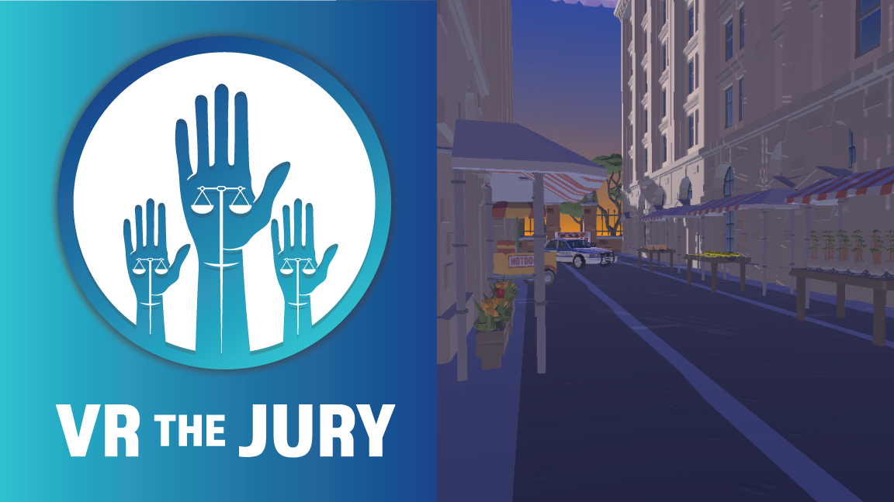

<!-- Improved compatibility of back to top link: See: https://github.com/othneildrew/Best-README-Template/pull/73 -->
<a name="readme-top"></a>
<!--
*** Thanks for checking out the Best-README-Template. If you have a suggestion
*** that would make this better, please fork the repo and create a pull request
*** or simply open an issue with the tag "enhancement".
*** Don't forget to give the project a star!
*** Thanks again! Now go create something AMAZING! :D
-->


<!-- PROJECT SHIELDS -->
<!--
*** I'm using markdown "reference style" links for readability.
*** Reference links are enclosed in brackets [ ] instead of parentheses ( ).
*** See the bottom of this document for the declaration of the reference variables
*** for contributors-url, forks-url, etc. This is an optional, concise syntax you may use.
*** https://www.markdownguide.org/basic-syntax/#reference-style-links
-->
<div align="center">
    
</div>
<!-- PROJECT LOGO -->
<br />
<div align="center">
  <h3 align="center">VR The Jury</h3>
  <p align="justify">
    A multi-platform "party game" that immerses one player in a 3D virtual scenario tasked with documenting a possible crime while non-immersed players act as a jury and make individual verdicts based on what the in-headset user chooses to document using their virtual camera. The game facilitates discussions about disparate perceptions and their implications for justice.
    <br />
    <div align="center">
      <a href="https://youtu.be/0CD9m4_zrqQ" target="_blank">View Demo</a>
    </div>
  </p>
</div>

<!-- TABLE OF CONTENTS -->
<details>
  <summary>Table of Contents</summary>
  <ol>
    <li>
      <a href="#about-the-project">About The Project</a>
      <ul>
        <li><a href="#built-with">Built With</a></li>
      </ul>
    </li>
    <li>
      <a href="#getting-started">Getting Started</a>
      <ul>
        <li><a href="#prerequisites">Prerequisites</a></li>
        <li><a href="#installation">Installation</a></li>
      </ul>
    </li>
    <li><a href="#contact">Contact</a></li>
    <li><a href="#acknowledgments">Acknowledgments</a></li>
  </ol>
</details>

<!-- ABOUT THE PROJECT -->
## About The Project

VR the Jury is a narrative-driven puzzle game that aims to bring immersive VR gameplay to a wider audience by allowing a non-VR player to join in the experience. The game is set in a courtroom and the player assumes the role of a juror who must investigate the case by solving puzzles, gathering evidence, and presenting their findings in court. The game consists of two modes: VR and PC. In VR mode, the player explores the crime scenes, interacts with objects and NPCs, and solves puzzles using hand movements and VR controllers. In PC mode, the player assists the VR player by examining documents, analyzing evidence, and providing advice through a dedicated interface. The level design is based on a linear narrative structure, with each level representing a day in the trial. The puzzles in each level are designed to be progressively challenging, with clues and evidence becoming more complex as the trial progresses. The cooperative gameplay mechanics are designed to create a sense of interdependence between the VR and PC players, encouraging collaboration and communication throughout the game.

In the second level, asymmetric mechanics of shooting for the VR player and shield for the PC player are introduced. Similar to level one, players first have time to practice the mechanics at their own pace and then play together in cooperative challenges. The game aims to encourage cooperation between the two players by designing challenges based on cooperative dynamics that create meaningful cooperation presented by Ptrick Redding in his GDC talk with the same topic. The PC player, a treasure hunter, is searching for treasure in ancient hidden cities while he/she meets the VR player, a time traveler. The two players have different skills to learn from each other, with the VR player having technology and futuristic knowledge, and the PC player having mythical knowledge of the ancient world. The two players have a mutual give-and-take relation and balanced abilities as the game progresses.

Project Goal: The goal of VR The Jury is to create an immersive and engaging VR puzzle game that provides a unique cooperative gameplay experience for both VR and non-VR players. The game is designed to be accessible to a wide range of players, with intuitive controls, an engaging narrative, and challenging puzzles that require both critical thinking and collaboration.

### Built With

Major frameworks/libraries used to bootstrap the project.

* Unity 2021.7 LTS
* Meta Quest 2

### Prerequisites

* Windows 10+
* Unity 2021+
* Meta Quest VR Headset; preferable Meta Quest 2.


### Installation

1. Clone the repo
   ```sh
   git clone https://github.com/kalpan-ag/VR-The-Jury.git
   ```
2. Open Project in Unity

3. Play the Project inside Unity or Make a Build

<!-- CONTACT -->
## Contact

* Kalpan Agrawal - agrawal.k@northeastern.edu
* [![LinkedIn][linkedin-shield]][linkedin-url]
* [![Portfolio][portfolioIcon-url]][portfolio-url]

<!-- MARKDOWN LINKS & IMAGES -->
<!-- https://www.markdownguide.org/basic-syntax/#reference-style-links -->
[linkedin-shield]: https://img.shields.io/badge/-LinkedIn-black.svg?style=for-the-badge&logo=linkedin&colorB=555
[linkedin-url]: https://www.linkedin.com/in/kp-ag/
[product-screenshot]: images/screenshot.png
[Next.js]: https://img.shields.io/badge/next.js-000000?style=for-the-badge&logo=nextdotjs&logoColor=white
[Next-url]: https://nextjs.org/
[portfolioIcon-url]: https://img.shields.io/badge/-Portfolio-brightgreen
[portfolio-url]: https://kalpan-ag.github.io/


